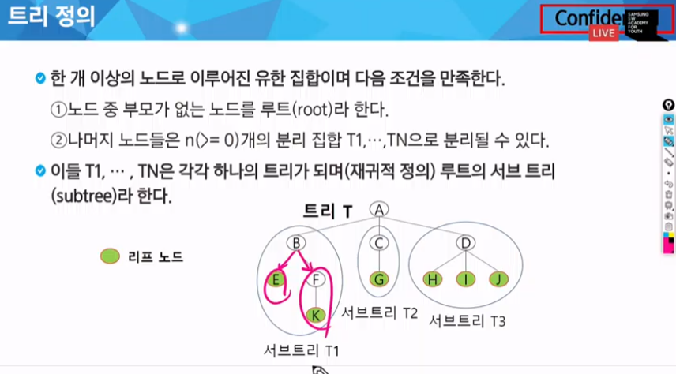
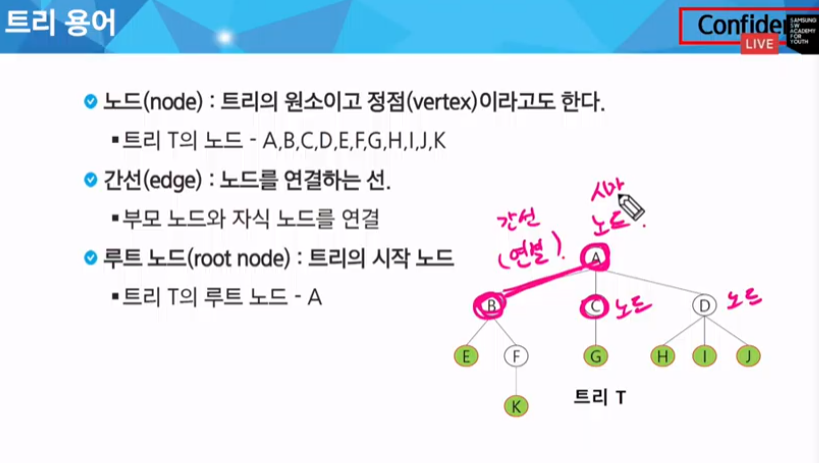
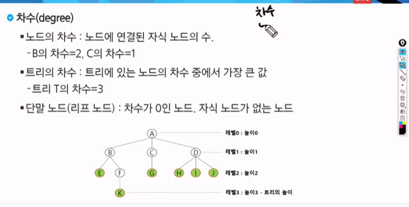
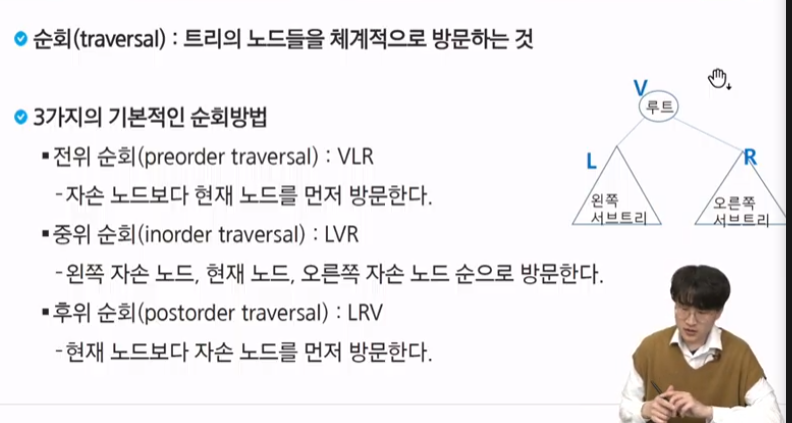

# 백트래킹 응용 & 그래프(트리)
완전탐색+가지치기
가능성이 없는(볼 필요 없는) 경우의 수를 제거하는 기법

완전 탐색 기반으로 코드가 일단 완전 탐색을 하는 코드를 생각

완전탐색 재귀
조건 볼필요도 없는 조건
가지치기

어디까지나 코딩테스트를 위해서...
중복된 순열
1~3까지숫자

1. 완탐 경우의수
2. 가지치기
대략적인 감소, 예측

# 트리
싸이클이 없는 무향 연결 그래프 
1. 싸이클
-방문했던 노드로 다시 돌아오는 다른 경로가 있는 경우
2. 무향
-간선에 방향이 없다(양방향)
3. 연결 그래프
- 모든 꼭지점이 서로 갈 수 있는 경로가 있다.

요 세가지를 만족하면 트리라고 부름

어떻게 자르던 트리가되는...그런...것...
그래서 재귀적 정의라고 교안에 나와있음
서브트리들이 합쳐서 큰 하나의 트리를 만들 수 있음

양옆은 형제
형제형제
우리는 모두 형제
형제 노드 끼리는 연결이 안된다

문제 풀 때 차수 노드 아주 중요중요
차수, 연결된 자식 노드의 수
트리의 차수는 트리 노드차수 중 가장 큰 값
높이는 시간 복잡도 땜시 알아야하는것

## 이진 트리
서브트리(자식)
자식 노드가 최대 2개인것
0,1,2를 가진게 이진트리

이게 다야~
이게 정의 전부 다야~
그래서 간단해서 높이 이런걸 쉽게 구할 수 있음

최악높이 N
최선 높이 logN

내가 인덱스 번호를 주었을 때 비어있는 번호가 없더라

이진트리를 만들 필요가 없다는 것
잘 못 된 자료구조를 구현을 하면 이렇게 될 수 있음
자 요거는 사실은 트리를 그리다보면 자연스럽게 익히게 된다.

작은 것 중에 제일 큰 것

트리의 특징 높이만큼 시간이 걸린다
정렬에 활요??
힙??
힙??
키값이 가장 크거나 작은걸 먼저 찾을래
하고 만든게 힙
큰거 먼저 하면 최대 힙
작은거 먼저하면 최소힙

특별한 큐 우선순위 큐를 구현하기 위해 쓴다. heapq라고 함
a , B 형에 많이 나오는 문제 중 하나니까
알아두렴~
그림으로 그릴줄 알아야함
